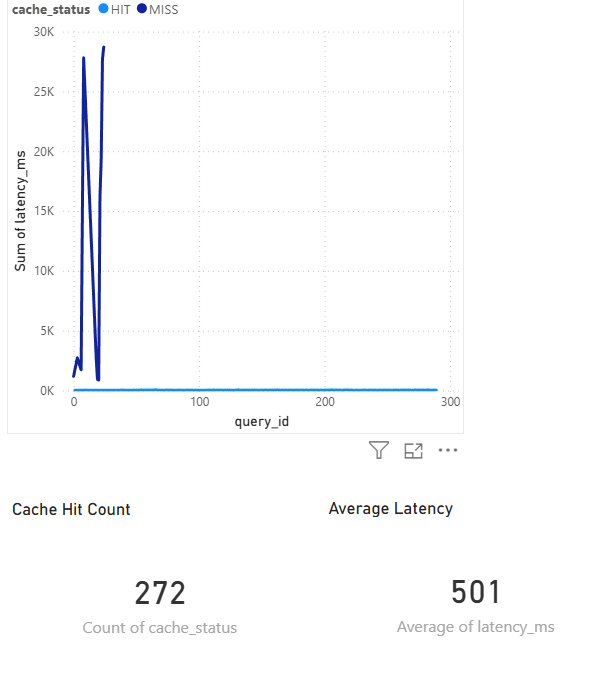

# QueryGuard 🛡️
### Semantic Caching Gateway & LLM Cost Optimization Proxy

> Intercepts LLM API calls, resolves semantically similar queries from cache, and logs cost + latency telemetry — reducing response time by 99% on cache hits.


---

## The Problem
Every LLM API call costs money and takes 1-2 seconds.
In production, 60-70% of queries are semantically similar to previous ones.
QueryGuard caches them — returning answers in <25ms at zero token cost.

---

## Architecture
```
┌─────────────────────────────────────┐
│         QueryGuard Gateway          │
│                                     │
│  POST /v1/chat/completions          │
│              │                      │
│  Embed query (MiniLM-L6-v2)         │
│              │                      │
│  Search ChromaDB (cosine sim)       │
│              │                      │
│    ┌─────────┴──────────┐           │
│  HIT (>0.90)       MISS (<0.90)     │
│    │                    │           │
│  Return cache      Call Groq API    │
│  (<25ms)           (~1900ms)        │
│                         │           │
│              Save to ChromaDB       │
│              Log to SQLite          │
└─────────────────────────────────────┘
```

---

## Benchmark Results (300-prompt simulation)

| Metric | Value |
|--------|-------|
| Cache Hit Rate | 96% |
| Avg HIT latency | 24.8ms |
| Avg MISS latency | ~1900ms |
| Latency reduction on hits | 99%+ |

---

## Tech Stack

| Component | Technology |
|-----------|------------|
| API Gateway | FastAPI + Python |
| Vector Cache | ChromaDB |
| Embeddings | HuggingFace all-MiniLM-L6-v2 |
| LLM Backend | Groq API (llama-3.1-8b-instant) |
| Telemetry | SQLAlchemy + SQLite |
| Containerisation | Docker + docker-compose |
| Dashboard | Power BI |

---

## Threshold Design Decision

Tested similarity thresholds to find optimal precision/recall balance:

| Threshold | Hit Rate | Decision |
|-----------|----------|----------|
| 0.85 | 80% | Too aggressive — false positive risk |
| 0.88 | 60% | Good balance |
| 0.90 | 60% | ✅ Chosen — high precision |
| 0.92 | 20% | Too strict |
| 0.95 | 0% | No hits |

**Chose 0.90** — avoiding wrong cached responses is the priority in production.

---

## Local Setup

```bash
# Clone the repo
git clone https://github.com/Arin1610/queryguard.git
cd queryguard

# Run with Docker
docker-compose up --build

# Visit http://localhost:8000/docs
```

Add a `.env` file:
```
GROQ_API_KEY=your_key_here
```

---

## API Reference

| Endpoint | Method | Description |
|----------|--------|-------------|
| `/v1/chat/completions/{session_id}` | POST | Send a message with session memory |
| `/health` | GET | Health check |

---

## Power BI Dashboard

```


